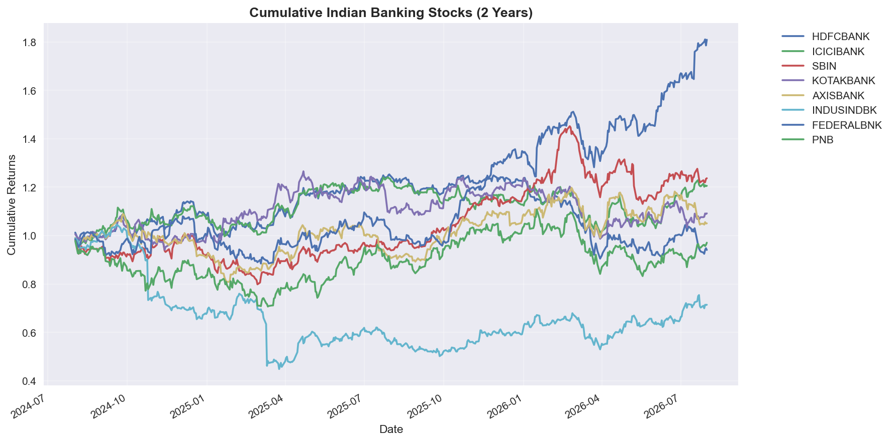
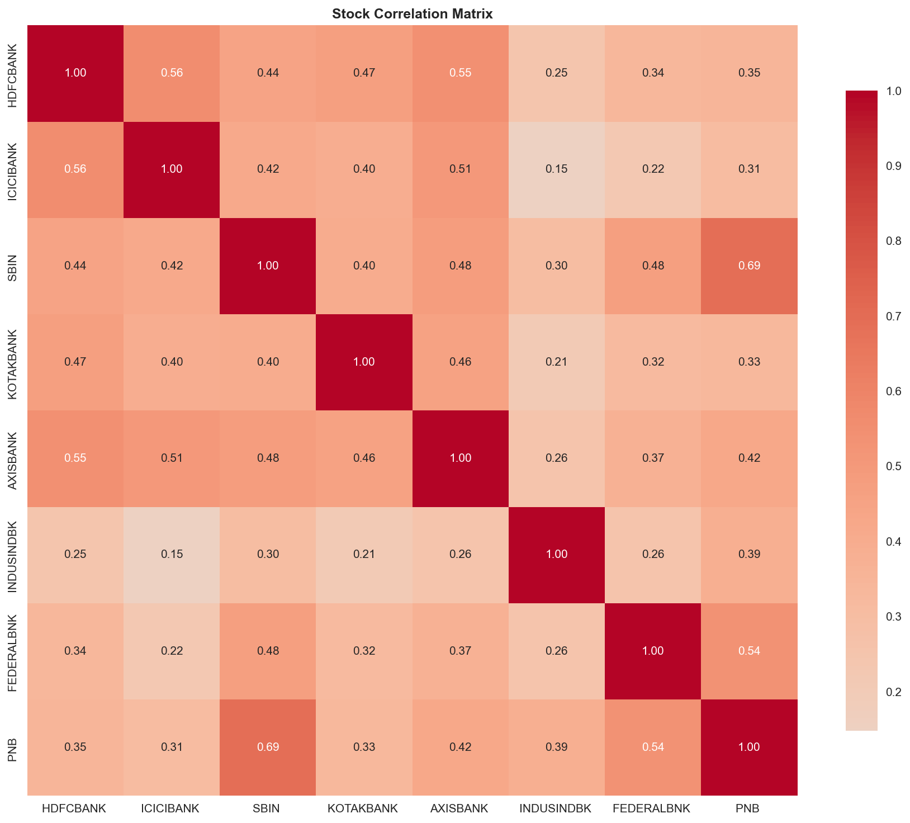

# indian-banking-stock-analysis
# Indian Banking Sector — Stock Market Analysis 🏦

## Overview
End-to-end Python analysis of 8 NSE-listed banking stocks over a 2-year period, 
combining technical analysis, fundamental analysis, and data visualisation to 
extract actionable insights on risk, return, and portfolio construction.

**Stocks Analysed:** HDFC Bank · ICICI Bank · SBI · Kotak Mahindra · Axis Bank · 
IndusInd Bank · Federal Bank · PNB

**Tools Used:** Python · pandas · yfinance · matplotlib · seaborn

---

## Key Findings

### Performance
- **Best Performer:** Federal Bank with a cumulative return of **+80.90%** over 2 years
- **Worst Performer:** IndusInd Bank with a cumulative return of **-28.58%**
- **Best Risk-Adjusted Return:** Federal Bank at **1.38%** — delivering the highest 
  return per unit of risk taken

### Risk
- **Lowest Risk Stock:** ICICI Bank with annualised volatility of just **18.56%** — 
  making it the most stable stock in the group despite strong overall returns
- IndusInd Bank was both the worst performer and carried significant volatility — 
  a poor risk-return trade-off relative to peers

### Correlation & Diversification
- **SBI and PNB showed the highest correlation (0.69)** — both are public sector 
  banks heavily influenced by the same government policy and RBI decisions, meaning 
  holding both offers limited diversification benefit
- **IndusInd Bank showed the lowest correlations across all peers (0.15–0.26)** — 
  despite its poor performance, it moves most independently from other banking stocks, 
  making it the strongest diversification candidate structurally
- Private sector banks (HDFC, ICICI, Axis, Kotak) cluster together in the 
  0.39–0.57 range — moderate correlation, driven by shared exposure to retail 
  and corporate lending cycles

### Business Insight
A portfolio concentrated in SBI and PNB carries **hidden concentration risk** — 
the high correlation means both stocks tend to fall together during the same 
macro events (rate hikes, NPL concerns, government budget changes), amplifying 
losses rather than smoothing them. Federal Bank stands out as the most attractive 
stock in this group on a pure risk-return basis.

---

## Charts

### Cumulative Returns — 2 Year Performance

### Risk vs Return Analysis

### Stock Correlation Matrix

---

## Project Structure
